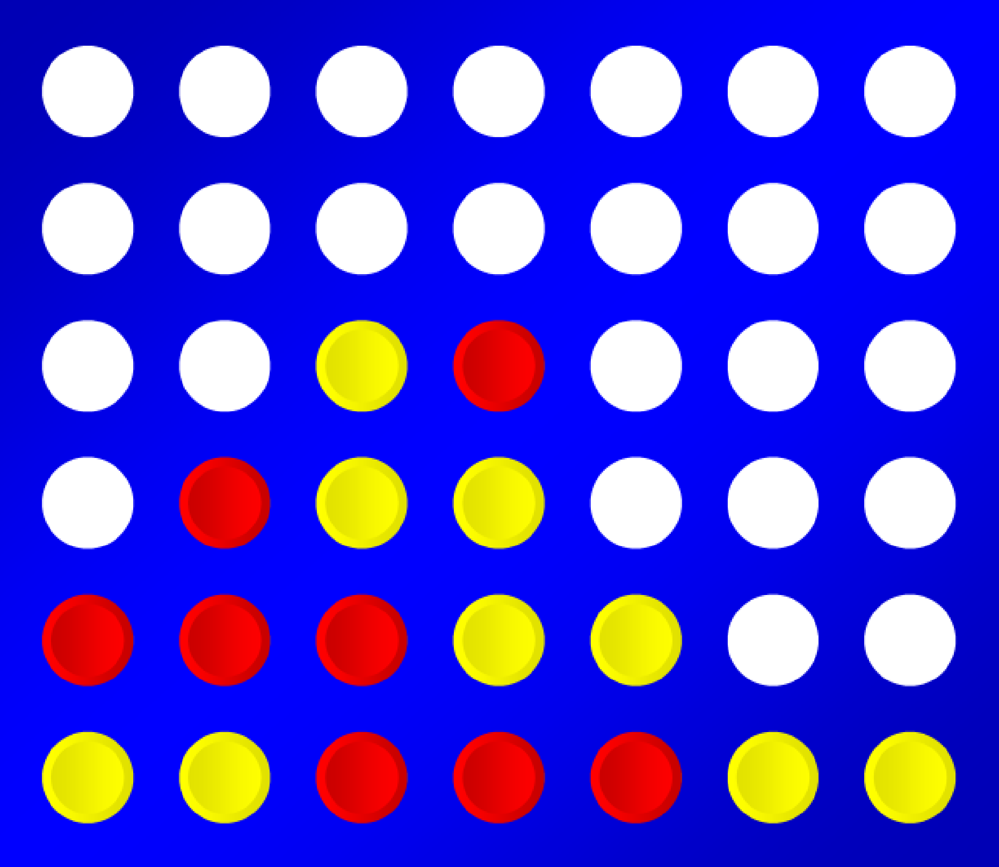

# MI_hf1
# Connect4 ágens

## 2022. szeptember 27.

<p align="center">
  
</p>

## Feladat

Ebben a házi feladatban a feladat egy ágens implementálása, amely képes egy másik ágenst legyőzni a Connect4 nevű játékban. A játék kétszemélyes, egy 6×7-es táblán játszódik. A játékosok felváltva ejtik bele a táblába a saját színüket. A győzelemhez 4 saját színt kell egy vonalban kirakni (függőlegesen/vízszintesen/átlósan). A játék, egy már megoldott játék, tehát annak jelenlegi állapotát ismerve a kimenete ismert, feltéve, hogy a játékosok tökéletesen játszanak. A tökéletes játékhoz azonban vagy előzetes számítások, vagy lépésenként sok idő szükséges. Ezért a <a href="http://mialmanach.mit.bme.hu/aima/ch06s02">MiniMax</a> algoritmus mélységkorlátozott változatának használatát javasoljuk. A feladat maximális pontot érő megoldásához szükség lehet bizonyos extrák használatára, ilyenek többek között az <a href="http://mialmanach.mit.bme.hu/aima/ch06s03">α-β nyesés</a> és a transzpozíciós tábla. Az ágens implementálható java és python nyelven is. A kiértékelés 3 lépésben történik, mindhárom esetben maximum 40 (java) ill. 50 (python) másodperc alatt kell lefutnia a programnak, és bele kell férnie 500 MB memóriába.

1. Játék egy mohó játékos ellen. _(4 pont)_
2. Játék egy olyan játékos ellen, amelyik 3 mélységig járja be a keresési fát. _(4 pont)_
3. Játék egy olyan játékos ellen, amelyik 5 mélységig járja be a keresési fát. _(4 pont)_

A feladat megoldásához kiadunk egy ahhoz nagyon hasonló futtatókörnyezetet, mint amin élesben fog történni a kiértékelés. Kérjük, hogy első körben ezen történjen meg a házi feladat tesztelése.


## Beadandó

- A Moodle felületre python (student_player.py) és java (StudentPlayer.java) esetében is egy-egy
    fájlt kell feltölteni. Ezekben a step() függvényt kell implementálni, ami azt adja vissza, hogy a játékos
    melyik oszlopba ejti a tokenjét.
       **-** Java esetében a step() fv. paramétere egy Board objektum, ami egy wrapper osztály a tábla
          állapotának tárolására. Maga a tábla egy 2 dimenziós tömb, amelyen 0 jelzi az üres helyet és 1
          ill. 2 a játékosok tokenjeit.
       **-** Python esetében a step() fv. paramétere a másik játékos által lerakott utolsó token oszlopa. Ha
          a másik játékos még nem rakott, akkor -1. A könnyebség kedvéért található a sablonban egy, a
          java implementációhoz hasonló Board osztály, amit lehet használni, de ki is lehet törölni a hozzá
          kapcsolódó kódsorokat. Használat esetén csak importolni kell, a kiértékel ̋o szerveren elérhet ̋o
          lesz.
       **-** Külso könyvtárak: ̋
          *Java esetén nem lehet használni semmilyen küls ̋o csomagot, csakis a java 8 beépített könyv-
             tárait.
          *Python 3 esetében lehet használni a numpy-t (1.19.4-es verzió).

## Hasznos tudnivalók

- A játék a Connect4Game osztályból indítható.
    **-** Java esetében aplayers[1] = new StudentPlayer(2, boardSize, nToConnect);sorral,
    **-** míg python esetében aplayers[1] = new PythonPlayer(2, boardSize, nToConnect);sorral
       legyen a 2. játékos példányosítva.
- Továbbá python esetén aPythonPlayer.java13. sorában legyen megadva a python elérési útja.
- Az alábbi táblázat tartalmazza a kiadott fájlok listáját és azok leírását.

```
Fáljnév Leírás
python/board.py python segédosztály a tábla tárolásához és kezeléséhez
(nem kötelez ̋o használni)
python/communication_slave.py python-t és java-t összeköt ̋o kód
python/student_code_binder.py python-t és java-t összeköt ̋o kód
python/student_player_skeleton.py az implementálandó ágens python skeletonja
src/Board.java java osztály a tábla tárolásához és kezeléséhez
src/CommunicationMaster.java python-t és java-t összeköt ̋o kód
src/Connect4Game.java a játék létrehozását és futtatását kezel ̋o osztály
src/ConsoleView.java konzolos megjelenít ̋o a játékhoz
src/GameLogic.java a játék logikáját futtató osztály
src/HumanPlayer.java példa ágens, ami konzolos bemenet alapján lép
src/Player.java az ágens ̋ososztálya
src/PythonPlayer.java python ágenst futtató java kód
src/StudentPlayer.java az implementálandó ágens java skeletonja
src/View.java ̋ososztály a játék megjelenítéséhez
```


